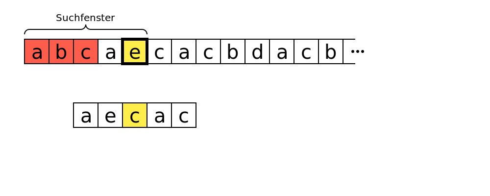

# algorithm-graphics
A Python library to generate graphics for explaining the functional principle of (pattern matching) algorithms.

More documentation coming soon. To generate a graphic such as the one shown below, use the following script:

```python3
from algorithmgraphics.colors import RED, YELLOW
from algorithmgraphics.generate import color_highlight, draw_char_list, save_png

def draw(cr):
    color_highlight(cr, 50, 80, RED, range(0, 3))
    color_highlight(cr, 50, 80, YELLOW, range(4, 5))
    color_highlight(cr, 200, 210, YELLOW, range(1, 2))

    cr.set_source_rgba(0, 0, 0, 1)
    draw_char_list(cr, 50, 80, 'abcaecacbdacb', highlight=[4], numbers=False, dots_right=True, brackets=[(0, 4, 0, 'Suchfenster')])
    draw_char_list(cr, 150, 210, 'aecac', numbers=False)

save_png(draw, 'graphic.png')
```


